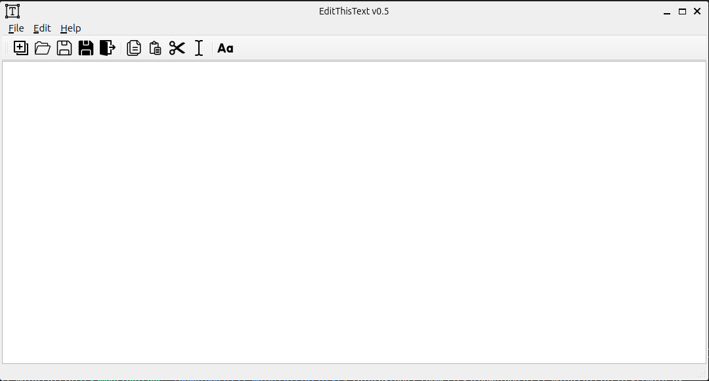
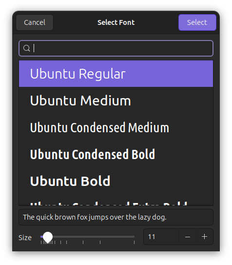

# EditThisText

EditThisText is a simple text editor application that allows you to create and edit text files using a graphical user interface. It is written in Python using the PyQt5 framework.

## Features

- Create a new file or open an existing file from your computer
- Save the file or save it as a different name or location
- Copy, paste, cut, and select all the text in the editor
- Change the font of the text using a font dialog
- Exit the application from the menu or toolbar
- Access the About window that displays the icon and the credits of the application

## Requirements

- Python 3.8 or higher
- PyQt5 5.15.4 or higher

## Installation

- Clone or download the repository from [GitHub]
- Install the required packages using `pip install -r requirements.txt`
- Run the main.py file using `python main.py`

## Screenshots

The main window of the text editor (Ubuntu, Gnome):

The main window of the text editro (Ubuntu, Gnome)

## Acknowledgments

- The icons used in this project are from https://icons8.com/ and https://pixabay.com/
